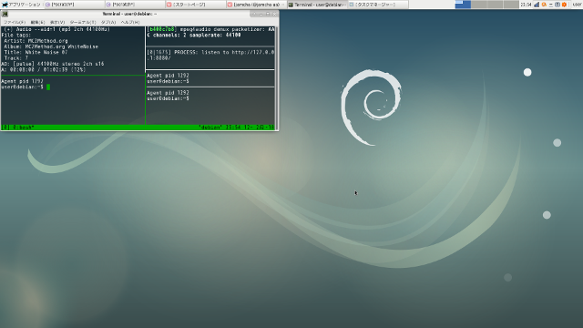

# 02 - EeePCとEmacsとLinuxと

それから私とEeePCはどのLinuxディストリビューションを使うか試しはじめた。当たり前だがWindowsはサポート切れ，BSDは私の知識不足，ゆえにOSの選択肢はLinux，人によってはGNU/Linux，しかなかった。しかも壊れるまで使うためにはそこそこサポートの長いものでなくてはいけないし，そもそも私は素人だからある程度の機能ははじめからついていてほしい。  

何よりEeePCは，ノートPCとしてもはや採用されることは永久にないであろう32bit CPUであり，Arch Linuxなどサポートを終えたものも珍しくない。Ubuntuも次期バージョンでは32bit版を提供しない。初めから候補は限られている。  

「ちなみに私をどんなマシンにしたいのか，具体的な目標はあるのか？」EeePCが聞いてきた。  

「そうだなぁ。本当は[Paul Mundt](https://jp.linux.com/linux-community/30linuxkerneldevelopers/393718-30linux-paul-mundt)さんみたいに使えればかっこいいんだろうけど…」「誰だ，その御仁は」「Linuxカーネルの開発者なんだけど，使ってるツールが本当にかっこいい」  

> fbcon、vim、muttを組み合わせて使っています。  

「どこがかっこいいのか全然わからんのだが」「え，だってfbconだよ」「fbcon？」「Xが起動しないんだ」「Xが起動しないって，あれか。君が昔，よくCtrl+Alt+F2で真っ黒な画面に落としていたが」「そう。それそれ」「それでこの御仁は作業をするのか」「そう」「ならば君もそうすればいい。昔は皆そうだったのだろう？」「えー，pdfとか画像を開くのにいちいちX立ち上げるなんて面倒だよ。マウスやGIMPを使いたいときだってあるし」「うーむ，やはり君は私なんか使わずにもっと良いコンピュータを使ったほうがいいんじゃないのか」「ふっふっふ。なぜ君を選んだのか，今にわかるよ」  

そんな下らない会話をしながら，私とEeePCはDebianベースのLinuxを次々と導入してはその使い勝手を確かめていた。  

「君は私のメモリが1GBしかないのをわかっているのだろうな」「もちろん」「それならLXDEのLubuntuとか，Kona Linux lightあたりで決まりではないのか？以前の私にも入れていただろう」  

Linuxのデスクトップ環境，というか見た目，は星の数ほどあるが，なかでもLXDEは圧倒的な軽さと機能の双方を兼ね備えたデスクトップ環境として人気である。  

「うーん，昔ならそれでよかったのかもしれないけど，認証鍵でちょっと手こずっちゃって。あと起動直後のメモリ消費量は少ないけど私の使い方ならXFCEとあまり変わらないな，と思って」  

XFCEもLXDEと並ぶ人気の軽量デスクトップ環境である。LXDEより多少メモリ消費量は多いが，その分機能も豊富だといわれる。  

「君が私をワープロとしてしか使わないのならMATEやcinnamonでも何でもいいんじゃないか？」  

「だめ!だって君ずっとスワップが真っ赤だったじゃん。覚えてないの？」  

星の数ほどあるデスクトップ環境のなかでも，GNOMEとKDEは双璧をなすといわれる。そのなかでMATEとcinnamonはGNOME 3における議論から分裂してできたものであり，どちらも洗練された見た目と使い勝手で人気のデスクトップ環境である。ただしLXDEやXFCEに比べると負荷は高く，メモリ消費量も多い。要するに重い。  

MATEを採用したUbuntu MATEと，cinnamonを採用したLinux MintをEeePCで試した際，スワップがどんどん食われ，HDDのゴリゴリという音が止まず心配であった。壊れるまで使う，という意味では手っ取り早く壊せていいのかもしれないが，それは本意ではない。同じ理由で，XFCEを採用するXubuntuも候補から外れた。かなり気に入っていたのだが。  

こうしてああでもない，こうでもないとEeePCと相談しながら，私は候補を絞っていった。  

   

候補も残り数種となって，私がLinux Mint Debian Edition，通称LMDEを候補から外したとき，EeePCが食いさがった。  

「なぜだ？君はかなり満足して使っていたようだったが」  

その通りだった。cinnamonを採用しながらメモリの消費量も少なく，EeePCでもあまり不満なく使えるLMDEは決定版といってよいほど素晴らしかった。だが私自身の，絶対に外せない一点がここに来て足を引っ張ってしまった。  

「ごめん。でもLMDEのluatexが古かったんだ」  

なんとも瑣末なことのように見える。「私はluatexでTeXの文書を書くから，OTFに対応していない古いluatexじゃダメなの」「TTFにすればいいんじゃないのか？」「OTFがいいの!」「あ，…そう」「それにOTFを.fontsディレクトリに入れたままだとluaotfload-toolが止まっちゃう。インデックスが作れないから」「ふむ。ただ，それならTeXが古いUbuntu系は真っ先に候補から外れそうなものだが」「Ubuntuはppaでパッケージを提供してくれた人がいたから対応できた」「LMDEにはそれができないわけか」「そう」  

EeePCはしばし沈黙した。「では私に入るLinuxはないのか？」  

「あるよ」「何だ？」  

私はその問いに答えずおもむろにセットアップを始めた。  

再起動し，デスクトップが表示される。  

  

「じゃーん」  

「なるほど，Debian『系』ではなく，そのものを入れたわけか」「そうそう。Debianだとスワップを8GB確保すれば，ブラウザでタブを10個くらい開いてもメモリは使いきらない」  

「だがluatexはどうしたんだ？無線LANも認識しないはずだが」「luatexは一時的にsidを有効にして入れたし，無線はfirmware-linux-nonfreeを入れたら認識したよ」「む，/etc/apt/sources.listにcontribとnon-freeが加えられているな。これはフリーウェアの精神に反するけしからん行為だ」「げ，OS入れ替えたら性格まで変わっちゃったよ」  

   
   
(c) 2018 jamcha (jamcha.aa@gmail.com).  

