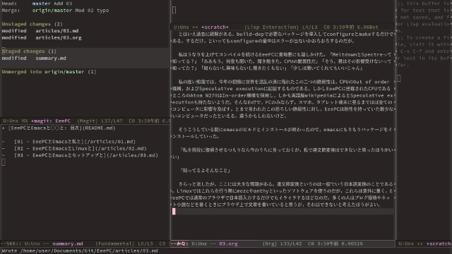
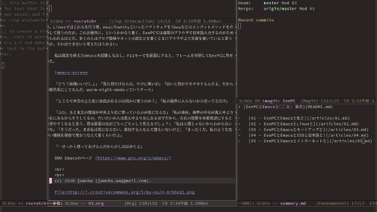

# 03 - EeePC と Emacs とセットアップと

それから私は EeePC にキーボード，マウス，USB スピーカーをつなぎ，PC モニタに外部出力した。先に USB 端子が三つある，と言ったのはこのためである。  

「やはり私の画面とキーボードではつらいか」「ええと，それもあるけど，私すぐに腱鞘炎になっちゃうから，普通のキーボードじゃダメなんだ」「Kinesis の何万もするやつか」「ううん，今使ってるのはマイクロソフトの安いやつ。手元がハの字に開いてるから痛くならない」「でも君は手が小さいだろう。届かないキーもあるんじゃないか？」「数字とか端のキーとかは遠いなあと思うことはあるけど，ワープロのときはほとんど使わないし。そうそう，こういうキーボード使ってると変なクセがつく，っていうけど今のところはないかな」  

「画面の小ささについては答えを聞いていないが」「うーん，やっぱ小さい，かな」「そうだろうな」「あ，でもフル HD まで出力できるんだよ。動画だって 720p までならなんとか見れるんだ。すごくない？」「私をスティック PC や NUC として使うつもりなのだな」「そうそう」「ノート PC として使うつもりはもうないのか」「いやあ，モニタに出せるの知っちゃったら目がラクでさあ」「…まあ，現役で使う，という君の言葉に偽りがないなら，それでもいいだろう」  

私と EeePC は必要なソフトのインストールを始めた。先の画像はそれを済ませた後のものだが，まあ，そのへんの手抜きは大目に見てもらいたい。  

ターミナルを分割させるための tmux。何はなくとも git。texlive。onedrive。後で使うために gnutls と curl も入れた。  

「そうだ，ノート PC で思い出した。聞いてくれる？」「何だ」「停電のとき，君の画面を白背景にして本読んだこと」「…ああ。覚えている」「電球は 60 ワット。君は 2.5 ワットくらいだったかな？でも明るくてさ。暖房つけられないから布団巻いて，頭の中でほたるの光が鳴ってたよ。なんか逆境のなかにいるからか，いつもより勉強に身が入ったというか」「じゃあずっと停電していればいいのか」「それはやだなー」  

そんな無駄話をしながら EeePC の肝となるソフトの導入を始めた。ワープロとテキストブラウザを兼ねる emacs である。これを書いている時点の最新版は 25.3，sid では 25.2 で止まっているため，ソースからコンパイルするという，私では想像できないほど高度な作業が求められることになった。  

とはいえ過去に経験がある。build-dep で必要なパッケージを導入して configure と make するだけである。するだけ，といっても configure の最中はエラーが出ないかおろおろするのだが。  

私はうなりを上げてコンパイルを続ける EeePC に意地悪にも話しかけた。「Meltdown と Spectre って知ってる？」「ああもう。何度も聞いた。聞き飽きた。CPU の脆弱性だ」「そう。君はその影響受けないって知ってた？」「知らないし興味もないし聞きたくもない」「少しは聞いてくれてもいいじゃん」  

私の拙い知識では，今年の初頭に世界を混乱の渦に陥れたこの二つの脆弱性は，CPU の Out of order 機構，および Speculative execution に起因するものである。しかし EeePC に搭載された CPU であるところの Atom N270 は In-order 機構を採用し，しかも英語版 wikipedia によると Speculative execution も持たないようだ。そんなわけで，PC のみならず，スマホ，タブレット端末に至るまでほぼ全てのコンピュータに影響を及ぼす，とまで言われたこの恐ろしい脆弱性に対し，EeePC は耐性を持っていた数少ないコンピュータだったといえる。違うかもしれないけど。  

そうこうしている間に emacs のビルドとインストールが終わったので，emacs にもりもりパッケージをインストールしていった。  

「私を現役に復帰させるつもりなら今のうちに言っておくが，私で連文節変換はできないと思ったほうがいい」  

「知ってるよそんなこと」  

さらっと流したが，ここには大きな問題がある。連文節変換というのは一般でいう日本語変換のことである。Linux ではこれらを行う際，mozc や anthy といったソフトウェアを ibus などのインプットメソッドを介して使うのだが，これが意外に，というかかなり重く，EeePC では通常のブラウザで日本語入力するのがためらわれるほどだ。多くの人はブログ投稿やネット小説などを書くときにブラウザ上で文章を書いていると思うが，それはできないと考えたほうがよい。  

私は設定を終えた emacs を起動しなおし，F11 キーで全画面にすると，ウィンドウを分割して EeePC に見せた。  

  

「どう？結構いいでしょ」「見た目だけならな。やけに黒いが」「白いと目がチカチカするんだよ。だから暖色系にしてるんだ。warm-night-mode っていうテーマ」  

「ところで本文の上と右に余白があるのは何かに使うのか？」「私の視界に入らないから切ってるだけ」  

「ふむ。あと本文の領域が中央より右に寄っているのが気になるな」「そこ注目するとこ？」「GitHub の Zen Writing Mode とか，Ommwriter とか，普通は真ん中に置くものだろう」「うーん，説明して面倒なやつだと思われるのやだから，好みってことにしておいて」  

「隠しごとは無しにしよう」「えー…。はぁ。えっと，人間の視野の中心は実は真ん中よりも左側にあって…」「面倒くさそうだな」「…」「すまん。続けてくれ」「…でも私の場合は，真ん中より右にあるからこうしたほうが見やすいの。だいたいの人は真ん中より左にあるはずだから，左右の配置を全部真逆にしたほうが見やすいと思う。君は画面の左がごちゃごちゃして見えるでしょ」  

「私は人間じゃないからわからないな」「そうだった。まあ私は気にならない。真似する人なんて誰もいないけど」「まったくだ。君は本当に変わったやつだな。私のような古い機械を現役で使おうなんて酔狂なことをするのも納得したよ」  

「…せっかく使ってあげるんだから少しはほめてよ」  

GNU Emacs のページ (<https://www.gnu.org/s/emacs/>)  

   
   
参考: レイアウトの左右を入れ替えたもの。熱弁するほどの違いはない。  

  

   
   
(c) 2018 jamcha (jamcha.aa@gmail.com).  

  

