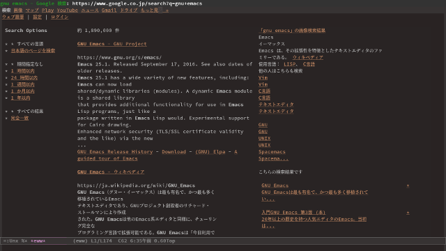

# 05 - EeePCとEmacsとインターネットと

その日，私はEeePCのサウンドデバイスをpavucontrolで切り替えると，スピーカーから音楽を流しながら文章を書いていた。すると，たまに私がブラウザを使うのを不思議に思ったのか，EeePCが私に質問をしてきた。これまで向こうから話しかけてくることなどなかったのだが，私に心を…心？コンピュータに心？とにかく，開いてくれたのだろうか。  

「君は時々ブラウザを使っているな。それなら他のコンピュータで良かったんじゃないのか」  

「これは私の文章がどう見えるか確かめるためだよ。普段は使わない」「普段は？…ああ，普段はewwか」  

eww &#x2013; emacs web wowser。emacsに標準でついているブラウザである。  

私はewwで検索をしてみせた。duckduckgoだと検索結果が見づらいのでgoogleを使うよう設定を変えてある。  

  

「速いな」テキストブラウザの名のとおり，本当にテキストのみである。ゆえに圧倒的に速い。  

「でも阿部寛のホームページが見れない」  

「それは実に残念だ」  

阿部寛のホームページはtableタグを使用しており，ewwが対応していないため，正しく表示されないのだ。  

「確かewwは画像表示もできたはずだが」「nov.elを入れればepubも読めるよ」「ふむ。だとするとなぜここでは表示されていないんだ？」「レイアウトが崩れるし重いから非表示にしてる。gifがあるページだと重くなるし」  

ewwはgifアニメーションに対応しているかわり，異様に重くなるという欠点がある。だから普段は非表示にしておいて，画像は必要に応じて閲覧する。  

「ewwをテキストブラウザとして使っているのはわかった。それにくらべてこのブラウザは何だ」「Vivaldiのこと？」「本当に遅いな」「失礼な。遅いのは君のせいだよ」「うーむ。我ながらじれったくなる」「でしょ？ブラウザ使うのが億劫になってこない？」「確かに」「だから君を使うんだよ」  

「そうか。そういうことか」EeePCはようやく自分の役割を理解したようだった。  

ブラウジングのストレスを下げるために世界中のIT技術者が日夜血のにじむような努力をしている。だが簡単にインターネットが利用できてしまうと，ついつい不要なページも見てしまう。水が高い所から低い所へ流れていくように，やがて布団の中でさえもインターネットにのめりこんでしまう。それを断ち切るためにキングジム社のポメラが世界中で大活躍していることは誰もが知るところであるが，インターネットを絶つと，些細な検索さえもできなくなってしまう。私がEeePCに求めた「テキストブラウザのついたワープロ」というのは，「tips程度の些細な検索を許容しつつ，のめりこめるほどは魅力的でないインターネット環境を持つワープロ」であった。  

たとえば，どうしても見たいページ，noteやmediumなど，Javascriptがないと表示されないページやプレビューの際は通常のブラウザを使うが，とても常用には耐えない。  

「検索はewwでするとして，githubはどうやって管理するんだ」「magitとかmagithubがあるよ」「メールは」「mew」「twitterは」「twit」「全然規制できてないじゃないか。じゃあInstagramは。Redditは。Slackは」「ワープロとして使おうとしてるんだからそこまで求めないでよ」  

「今のyoutubeは無理そうだな。昔は良く見たものだが」「mpv使えば今でも見れるけど，たぶん使わない」「見れるのか」「見れるよ」「見てもいいか」  

それはかつて当然のようにできていたことだ。だが今，ブラウザでyoutubeを開いてもコマ落ちがひどく見られたものではない。その現実をつきつけたくはなかった。  

私は，ターミナルで次のコマンドを打ち込んだ。  

mpv <https://upload.wikimedia.org/wikipedia/commons/1/17/Experience_ubuntu.ogv>  

ウインドウが開かれ，わずか数秒たらず。EeePCは絶句した。初期のUbuntuに同梱されていた，ネルソン・マンデラ氏へのインタビュー動画である。Ubuntuの魂が込められた傑作中の傑作だ。EeePCでもコマ落ちしない。だがそれはこの動画が10年以上前のものだからだ。「この動画すごいよ」と軽い気持ちで見るような内容でもない。EeePCが，いや，ほとんどの人がこんな場面で求めるものでもない。時がそこだけ止まってしまったようだ。それまでの空気が急激にしらけてゆく。  

「ね，見れるでしょ」  

「…君は私をこんな目にあわせて楽しいのか？」  

EeePCは自分が侮辱されたと感じたのだろう。本当だったら，人気歌手のミュージックビデオや，ゲームのトレーラーといったものを見て，かつての輝きを感じたかったかもしれない。昔の私をなぐさめ，そして励ましたように。  

だがEeePCではもはや今のインターネットを自由に動き回ることができない。このポンコツをタブレットやスマホの代わりに使うにはあまりに無力だからだ。  

それでも私のEeePCには大事な役割がある。それは私と出会ったあの頃から，いや，はるか昔，初めてコンピュータに触ったときから，ずっと私が求めていたものだ。そしてそれは，これからもきっと変わらない。  

それは[文章を読み，そして書くこと](https://www.youtube.com/watch?v%3DVADudzQGvU8&feature%3Dyoutu.be&t%3D24m)。  

それなら私のEeePCは今でも十分に果たせる。そしてそれができるなら十分だ。  

だから。  

「楽しいよ。すごく楽しい」  

「え？」「今でもこんなふうに君を使えるなんて思ってなかったから」  

だから，私は楽しくて仕方がないんだ。  

「…そうか。君が楽しいのなら，それでいい」  

   
   

こうして私は自分の考えたアイデアの全てをEeePCに見せた。  

「ふーむ」  

「どう？ちゃんと使えるでしょ？かっこよくない？」  

「デスクトップLinuxの操作を苦とせず，emacsで大抵のことをしようとし，しかもSKKが使えなきゃいけない。かなりの物好きじゃないと私を現役で使うのは困難だ，ということはわかった」  

「そんな変わってるかな。普通でしょ。emacs使える人ならLinuxとかSKKも使えそうに思えるけど」  

「でも私でプログラミングはしないのだろう？」  

「うん。だってワープロだし」  

「そこは譲らないのだな」  

「譲らないよ」  

   

  

   

&#x2013; 了 &#x2013;  

   
   
   
   

(参考) 初期のUbuntuに同梱されていたインタビュー動画の様子。この画像を本文中に表示したとき，あまりのインパクトにその後の文章が頭に入らなかったため末尾に移した。  

  

(<https://en.wikipedia.org/wiki/File:Experience_ubuntu.ogv>)  

   
   
(c) 2018 jamcha (jamcha.aa@gmail.com).  

