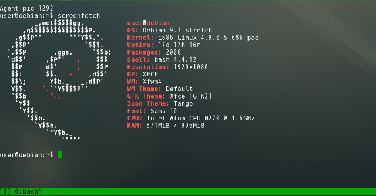
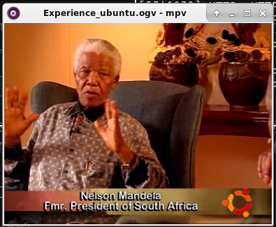

# 06 - EeePCとEmacsと私の大切なアシスタント

普通のブラウザではブログを開くだけでもブラウザがもたつく。さすがに阿部寛のホームページは速い。だがその前が問題だ。阿部寛のホームページをGoogleやBingで検索するのはためらわられるほど，検索結果の表示に時間がかかるのだ。  

その様子を見ながら，EeePCは昔の自分と比較していたようだ。「今のyoutubeは無理そうだな。昔は良く見たものだが」「mpv使えば今でも見れるけど，たぶん使わない」「見れるのか」「見れるよ」「見てもいいか」  

それはかつて当然のようにできていたことだ。だが今，ブラウザでyoutubeを開いてもコマ落ちがひどく見られたものではない。その現実をつきつけたくはなかった。  

私は，ターミナルで次のコマンドを打ち込んだ。  

mpv <https://upload.wikimedia.org/wikipedia/commons/1/17/Experience_ubuntu.ogv>  

ウインドウが開かれ，わずか数秒たらず。EeePCは絶句した。表示されたのは，初期のUbuntuに同梱されていた，ネルソン・マンデラ氏へのインタビュー動画である。Ubuntuの魂が込められた傑作中の傑作だ。EeePCでもコマ落ちしない。ただ，この動画は10年以上前のものだ。「この動画すごいよ」と軽い気持ちで見るような内容でもない。それまでの空気が急激にしらけてゆく。  

「ね，見れるでしょ」  

「…君は私をこんな目にあわせて楽しいのか？」  

EeePCは自分が侮辱されたと感じたのだろう。本当だったら，人気歌手のミュージックビデオや，ゲームのトレーラーといったものを見て，かつての輝きを感じたかったかもしれない。昔の私をなぐさめ，そして励ましたように。  

だがEeePCではもはや今のインターネットを自由に動き回ることができない。このポンコツをタブレットやスマホの代わりに使うにはあまりに無力だからだ。  

ではEeePCが役立たずかといえばそうではない。今のEeePCには，youtubeで動画を見ることより，もっと大事な役割があるからだ。  

それは[文章を読み，そして書くこと](https://www.youtube.com/watch?v%3DVADudzQGvU8&feature%3Dyoutu.be&t%3D24m)。  

それは私と出会ったあの頃から，いや，私が初めてコンピュータに触ったときからずっと求めていたものだ。そしてそれは，これからもきっと変わらない。  

   

「楽しいよ。すごく楽しい」  

「え？」「今でもこんなふうに君を使えるなんて思ってなかったから」  

だから，私は楽しくて仕方がないんだ。  

「…そうか。君が楽しいのなら，それでいい」  

   
   

こうして私は自分の考えたアイデアの全てをEeePCに見せた。  

「ふーむ」  

「どう？ちゃんと使えるでしょ？かっこよくない？」  

「デスクトップLinuxの操作を苦とせず，emacsで大抵のことをしようとし，しかもSKKが使えなきゃいけない。かなりの物好きじゃないと私を現役で使うのは困難だ，ということはわかった」  

「そんな変わってるかな。普通でしょ。emacs使える人ならLinuxとかSKKも使えそうに思えるけど」  

「でも私でプログラミングはしないのだろう？」  

「うん。だってワープロだし」  

「そこは譲らないのだな」  

「譲らないよ」  

   

  

   

&#x2013; 了 &#x2013;  

   
   
   
   

(参考) 初期のUbuntuに同梱されていたインタビュー動画の様子。この画像を本文中に表示したとき，あまりのインパクトにその後の文章が頭に入らなかったため末尾に移した。  

  

(<https://en.wikipedia.org/wiki/File:Experience_ubuntu.ogv>)  

   
   
(c) 2018 jamcha (jamcha.aa@gmail.com).  

